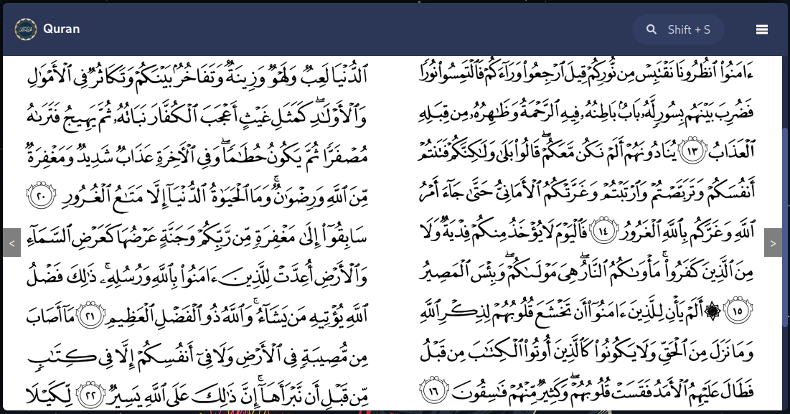

# Quran app

 
    
    
 
A cross-platform quran app built with go and svelte using wails.

## Features

The app works perfectly on windows and linux, even though I haven't tested on macos but it should work too!
It features a 2 splitted (right and left) pages like the Mushaf.

- Read the quran.
- Search Ayaht.

## Building

If you want to build the application yourself, make sure you have `wails` installed to run and build.
- `wails build` to build.
- `wails dev` to fire a live development with hot reload

## Notes
- I have face issues with svelte and wails rendering dynamic routes, I fixed these using a dirty hack which isn't ideal. Following the docs didn't help I had to set : `export const prerender = 'auto';` and `export const ssr = false;` in `+layout.ts`
- Searching is really the best as I am looping through the list on the frontend, this will be optimized in the future.
- UI/UX needs some work too: I made the size of the window fixed as I don't know how to scale the images properly.
- The qurna images generated by [quran.com](https://github.com/quran/quran.com-images), credits go to them :D

## TODO

- [ ] Fix wrong search due to tashkeel and others
- [ ] Add vim keybindings
- [ ] Optimize app size by reducing images quality
- [ ] Optimize ayah search by using go to search or using sqlite [Speed]
- [ ] Optimize ayah search [Correctness]
- [ ] Highlight ayah
- [ ] Bookmark Ayahts.
- [ ] Listen to Ayahts.
